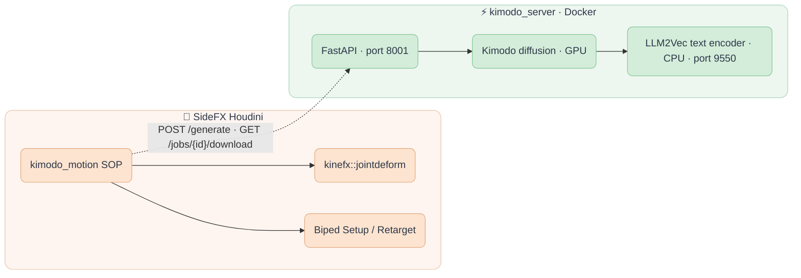

<div align="center">

  
  &nbsp;&nbsp;&nbsp;&nbsp;
  

  <h3 align="center">fxhoudinikimodo</h3>

  <p align="center">
    NVIDIA Kimodo text-to-motion inside SideFX Houdini.
    <br/>
    One KineFX SOP: type a prompt, get a skinned, animated character.
    <br/><br/>
  </p>

  ##

  <p align="center">
    <!-- Maintenance status -->
    &nbsp;&nbsp;
    <!-- License -->
    &nbsp;&nbsp;
    <!-- Last Commit -->
    &nbsp;&nbsp;
    <!-- Commit Activity -->
    <a href="https://github.com/healkeiser/fxhoudinikimodo/pulse" alt="Activity">
      </a>&nbsp;&nbsp;
    <!-- GitHub stars -->
    &nbsp;&nbsp;
  </p>

</div>

<!-- TABLE OF CONTENTS -->
## Table of Contents

- [About](#about)
- [Features](#features)
- [Architecture](#architecture)
- [Installation](#installation)
- [Usage](#usage)
- [Environment Variables](#environment-variables)
- [Development](#development)
- [Credits](#credits)
- [Contact](#contact)
- [License](#license)

<!-- ABOUT -->
## About

[Kimodo](https://github.com/nv-tlabs/kimodo) is NVIDIA Research's kinematic motion diffusion model: give it an English sentence such as `a person walks forward slowly`, optionally a root path or pose keyframes, and it generates a 77-joint SOMA human motion clip. It runs locally on an NVIDIA GPU.

**fxhoudinikimodo** brings it into Houdini as a single SOP, `kimodo_motion`. The node talks to a small FastAPI server that keeps the model resident on the GPU, pulls the result back over HTTP, and rebuilds it as KineFX geometry: a skinned body, its capture pose, the animated skeleton and a T-pose, in the same output order as Houdini's own Test Geometry characters. A Joint Deform wired straight across gives you a moving body; Biped Setup and Biped Retarget move that motion onto your own rig.

This is a fork of [chordee/kimodo-houdini-bridge](https://github.com/chordee/kimodo-houdini-bridge) with a reworked node interface, scene-FPS retiming and Windows fixes. See [Credits](#credits).

<!-- FEATURES -->
## Features

| Area | What you get |
|------|--------------|
| **Prompt to motion** | Multi-line prompt, duration in scene frames, model choice, one Generate button. Runs in the background; the node recooks when the clip lands. |
| **SideFX output order** | 0 Rest Geometry, 1 Capture Pose, 2 Animated Pose, 3 T-Pose. `kinefx::jointdeform` wires 0 → 0, 1 → 1, 2 → 2. |
| **Timing that matches your scene** | Kimodo samples at 30 fps. Start Frame (default `$FSTART`) and Retime to Scene FPS keep a 3 s clip at 3 s whether you work at 24, 25 or 30. |
| **Constraints** | Root path from any curve or points on input 0. Full-body or hand/foot pose keyframes from a posed skeleton on input 1, with a Create Pose Rig button. Raw Kimodo constraint JSON if you prefer. |
| **Foot contacts** | Kimodo's per-frame contact labels arrive as an `int contact` point attribute, ready for foot locking or footstep FX. |
| **Server that stays warm** | Model preloaded once, results cached by prompt + duration + model + constraints, text encoder on CPU to spare VRAM. Runs on your workstation or a remote GPU box. |
| **Status where you look** | Job state shown under the node in the network editor, plus a Test Connection button. No modal dialogs on Generate. |
| **Offline loader** | Point NPZ Path at any SOMA77 clip produced elsewhere and the node rebuilds it without a server. |

<!-- ARCHITECTURE -->
## Architecture



Diffusion needs about 4 GB of VRAM and stays resident while the `api` container runs. Text encoding is offloaded to CPU. Houdini only ever sees HTTP and an NPZ file, so the server can live on any machine you can reach.

<!-- INSTALLATION -->
## Installation

Two halves: a **Docker server** that runs Kimodo, and a **Houdini package** that loads the HDA. The full walkthrough, including Windows specifics, is in [docs/setup.md](docs/setup.md).

### Requirements

- **Houdini** 20.5+ (developed on 22.0.368)
- **Docker Desktop** with the WSL2 backend and GPU support on Windows, or Docker Engine + NVIDIA Container Toolkit on Linux
- **NVIDIA GPU**, 4 GB VRAM minimum, 6 GB if Houdini shares the card
- **~50 GB disk**: the CUDA base image alone is 35 GB, plus model weights and the Hugging Face cache
- A **Hugging Face** account. The text encoder is built on Meta's Llama 3 8B Instruct, which is gated; see the setup guide for the mirror route if Meta declines your request.

### Server

```shell
git clone https://github.com/nv-tlabs/kimodo.git
cd kimodo
git clone https://github.com/nv-tlabs/kimodo-viser.git
docker build -t kimodo:1.0 .

# bridge files into the kimodo dir
cp /path/to/fxhoudinikimodo/kimodo_server.py /path/to/fxhoudinikimodo/docker-compose.bridge.yaml .
mkdir -p output

# weights (Kimodo is ungated; the Llama-based text encoder needs your HF token)
hf download nvidia/Kimodo-SOMA-RP-v1.1

docker compose -f docker-compose.bridge.yaml up text-encoder -d   # wait for "healthy"
MOCK_MODE=0 docker compose -f docker-compose.bridge.yaml up api -d
curl http://localhost:8001/health     # {"status":"ok","mock_mode":false}
```

On Windows, add a `.env` next to the compose file with `HF_HOME=C:/Users/<you>/.cache/huggingface`; the compose file falls back to `$HOME`, which Windows does not set. Large weight downloads are faster on the host (`uv tool run --from huggingface_hub hf download ...`) than through the Docker bind mount.

### Houdini

```shell
"C:\Program Files\Side Effects Software\Houdini 22.0.xxx\bin\hython.exe" -m pip install requests scipy numpy
```

Copy `fxhoudinikimodo.json` into `$HOUDINI_USER_PREF_DIR/packages/` and set `KIMODO_BRIDGE_ROOT` in it to this repo's absolute path. Restart Houdini. The node appears under **Tab ▸ Kimodo**.

<!-- USAGE -->
## Usage

1. Drop a **Kimodo Motion** SOP. Press **Test Connection** on the Server tab; Status should read `Server OK`.
2. Type a prompt, set **Duration (frames)**, press **Generate**. The status under the node goes Queued → Running → Done and the node recooks. A 3 s clip takes about 40 s on an RTX 4090; identical requests return from cache instantly.
3. Wire a **Joint Deform**: outputs 0, 1, 2 into inputs 0, 1, 2. Scrub.
4. To steer: connect a curve to input 0 for a root path, or press **Create Pose Rig**, pose it, list the frames in **Pose Keyframes**.
5. To put the motion on your own character: **Biped Setup** on both skeletons, **Biped Retarget**, then your deformer. Feed output 3 (T-Pose) through a **Rig Stash Pose** to give Biped Setup a clean rest pose; do not let it synthesise one from the walk.

Parameter by parameter: [hda/README.md](hda/README.md).

<!-- ENVIRONMENT VARIABLES -->
## Environment Variables

Read by `docker-compose.bridge.yaml`:

| Variable | Default | Purpose |
|----------|---------|---------|
| `HF_HOME` | `$HOME/.cache/huggingface` | Host folder mounted as the Hugging Face cache. Set explicitly on Windows. |
| `HUGGING_FACE_HUB_TOKEN` | — | Token for gated downloads (the Llama text encoder). |
| `KIMODO_MODEL` | Kimodo default | Checkpoint preloaded by the `api` container. |
| `KIMODO_PORT` | `8001` | API port. 8000 is taken by Docker Desktop on Windows. |
| `MOCK_MODE` | `0` | `1` serves `output/dev_reference.npz` without inference, for HDA work without a GPU. |
| `HF_HUB_OFFLINE` | `1` | Load weights from the local cache only; set `0` for a one-time download. |
| `TEXT_ENCODERS_DIR` | — | Local folder of LLM2Vec adapters, when you cannot pull Meta's repo directly. |

<!-- DEVELOPMENT -->
## Development

The HDA is generated, not hand-edited. `scripts/create_hda.py` is the single source of the node interface, cook scripts and callbacks; `hda/kimodo_motion.hda/` is the expanded, VCS-friendly result.

```shell
# 1. embedded skin mesh + A-pose skeleton (needs the kimodo repo cloned alongside)
hython scripts/build_skin.py

# 2. the HDA itself, packed, in the repo root
hython scripts/create_hda.py

# 3. help card, saved expanded into hda/
hython scripts/_add_help.py
```

In a running Houdini, reload with `hou.hda.reloadFile(...)` and call `matchCurrentDefinition()` on existing nodes. Anything changed in Type Properties by hand is overwritten on the next rebuild, so fold it into the script instead. The node icon is `scripts/kimodo_icon.svg`.

<!-- CREDITS -->
## Credits

- [chordee/kimodo-houdini-bridge](https://github.com/chordee/kimodo-houdini-bridge): the original server, HDA, skinning and transform-convention work this fork builds on.
- [NVIDIA Kimodo](https://github.com/nv-tlabs/kimodo) and the [SOMA](https://research.nvidia.com/labs/sil/projects/kimodo/) skeleton.
- [McGill-NLP LLM2Vec](https://github.com/McGill-NLP/llm2vec) for the text encoder.

<!-- CONTACT -->
## Contact

Project Link: [fxhoudinikimodo](https://github.com/healkeiser/fxhoudinikimodo)

<p align='center'>
  <!-- GitHub profile -->
  <a href="https://github.com/healkeiser">
    </a>&nbsp;&nbsp;
  <!-- LinkedIn -->
  <a href="https://www.linkedin.com/in/valentin-beaumont">
    </a>&nbsp;&nbsp;
  <!-- Behance -->
  <a href="https://www.behance.net/el1ven">
    </a>&nbsp;&nbsp;
  <!-- X -->
  <a href="https://twitter.com/valentinbeaumon">
    </a>&nbsp;&nbsp;
  <!-- Instagram -->
  <a href="https://www.instagram.com/val.beaumontart">
    </a>&nbsp;&nbsp;
  <!-- Gumroad -->
  <a href="https://healkeiser.gumroad.com/subscribe">
    </a>&nbsp;&nbsp;
  <!-- Gmail -->
  <a href="mailto:valentin.onze@gmail.com">
    </a>&nbsp;&nbsp;
  <!-- Buy me a coffee -->
  <a href="https://www.buymeacoffee.com/healkeiser">
    </a>&nbsp;&nbsp;
</p>

## License

The bridge code, HDA and scripts follow the upstream project's terms: released for personal and research use. The NVIDIA Kimodo weights are under the [NVIDIA Open Model License](https://www.nvidia.com/en-us/agreements/enterprise-software/nvidia-open-model-license), and the text encoder's base weights under the Llama 3 Community License. Read both before any use beyond personal testing.
