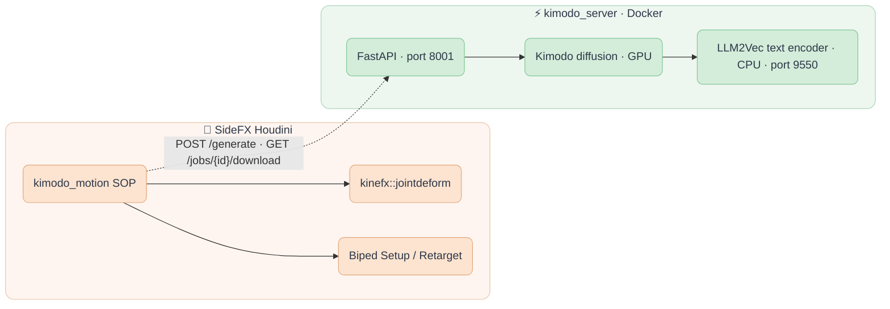

<div align="center">

  
  &nbsp;&nbsp;&nbsp;&nbsp;
  

  <h3 align="center">fxhoudinikimodo</h3>

  <p align="center">
    NVIDIA Kimodo text-to-motion inside SideFX Houdini.
    <br/>
    One KineFX SOP: type a prompt, get a skinned, animated character.
    <br/><br/>
  </p>

  ##

  <p align="center">
    <!-- Maintenance status -->
    &nbsp;&nbsp;
    <!-- License -->
    &nbsp;&nbsp;
    <!-- Last Commit -->
    &nbsp;&nbsp;
    <!-- Commit Activity -->
    <a href="https://github.com/healkeiser/fxhoudinikimodo/pulse" alt="Activity">
      </a>&nbsp;&nbsp;
    <!-- GitHub stars -->
    &nbsp;&nbsp;
  </p>

</div>

<!-- TABLE OF CONTENTS -->
## Table of Contents

- [About](#about)
- [Features](#features)
- [Architecture](#architecture)
- [Installation](#installation)
- [Usage](#usage)
- [Writing Prompts](#writing-prompts)
- [Regenerating Part of a Clip](#regenerating-part-of-a-clip)
- [Environment Variables](#environment-variables)
- [Development](#development)
- [Credits](#credits)
- [Contact](#contact)
- [License](#license)

<!-- ABOUT -->
## About

[Kimodo](https://github.com/nv-tlabs/kimodo) is NVIDIA Research's kinematic motion diffusion model: give it an English sentence such as `a person walks forward slowly`, optionally a root path or pose keyframes, and it generates a 77-joint SOMA human motion clip. It runs locally on an NVIDIA GPU.

**fxhoudinikimodo** brings it into Houdini as a single SOP, `kimodo_motion`. The node talks to a small FastAPI server that keeps the model resident on the GPU, pulls the result back over HTTP, and rebuilds it as KineFX geometry: a skinned body, its capture pose, the animated skeleton and a T-pose, in the same output order as Houdini's own Test Geometry characters. A Joint Deform wired straight across gives you a moving body; Biped Setup and Biped Retarget move that motion onto your own rig.

This is a fork of [chordee/kimodo-houdini-bridge](https://github.com/chordee/kimodo-houdini-bridge) with a reworked node interface, scene-FPS retiming and Windows fixes. See [Credits](#credits).

<!-- FEATURES -->
## Features

| Area | What you get |
|------|--------------|
| **Prompt to motion** | Multi-line prompt, duration in scene frames, model choice, one Generate button. Runs in the background; the node recooks when the clip lands. |
| **Timeline panel** | Dockable Python Panel: prompt segments laid end to end (drag to resize or reorder, double-click to edit, split at playhead), Kimodo transition length, and Full Body / hand / foot pose tracks with draggable keys. Everything is stored on the node and undoable. |
| **SideFX output order** | 0 Rest Geometry, 1 Capture Pose, 2 Animated Pose, 3 T-Pose. `kinefx::jointdeform` wires 0 → 0, 1 → 1, 2 → 2. |
| **Timing that matches your scene** | Kimodo samples at 30 fps. Start Frame (default `$FSTART`) and Retime to Scene FPS keep a 3 s clip at 3 s whether you work at 24, 25 or 30. |
| **Constraints** | Root path from any curve or points on input 0. Full-body or hand/foot pose keyframes from a posed skeleton on input 1, with a Create Pose Rig button. Raw Kimodo constraint JSON if you prefer. |
| **Foot contacts** | Kimodo's per-frame contact labels arrive as an `int contact` point attribute, ready for foot locking or footstep FX. |
| **Server that stays warm** | Model preloaded once, results cached by prompt + duration + model + constraints, text encoder on CPU to spare VRAM. Runs on your workstation or a remote GPU box. |
| **Status where you look** | Job state shown under the node in the network editor, plus a Test Connection button. No modal dialogs on Generate. |
| **Offline loader** | Point NPZ Path at any SOMA77 clip produced elsewhere and the node rebuilds it without a server. |

<!-- ARCHITECTURE -->
## Architecture



Diffusion needs about 4 GB of VRAM and stays resident while the `api` container runs. Text encoding is offloaded to CPU. Houdini only ever sees HTTP and an NPZ file, so the server can live on any machine you can reach.

<!-- INSTALLATION -->
## Installation

Two halves: a **Docker server** that runs Kimodo, and a **Houdini package** that loads the HDA. The full walkthrough, including Windows specifics, is in [docs/setup.md](docs/setup.md).

### Requirements

- **Houdini** 20.5+ (developed on 22.0.368)
- **Docker Desktop** with the WSL2 backend and GPU support on Windows, or Docker Engine + NVIDIA Container Toolkit on Linux
- **NVIDIA GPU**, 4 GB VRAM minimum, 6 GB if Houdini shares the card
- **~50 GB disk**: the CUDA base image alone is 35 GB, plus model weights and the Hugging Face cache
- A **Hugging Face** account. The text encoder is built on Meta's Llama 3 8B Instruct, which is gated; see the setup guide for the mirror route if Meta declines your request.

### Server

```shell
git clone https://github.com/nv-tlabs/kimodo.git
cd kimodo
git clone https://github.com/nv-tlabs/kimodo-viser.git
docker build -t kimodo:1.0 .

# bridge files into the kimodo dir
cp /path/to/fxhoudinikimodo/kimodo_server.py /path/to/fxhoudinikimodo/docker-compose.bridge.yaml .
mkdir -p output

# weights (Kimodo is ungated; the Llama-based text encoder needs your HF token)
hf download nvidia/Kimodo-SOMA-RP-v1.1

docker compose -f docker-compose.bridge.yaml up text-encoder -d   # wait for "healthy"
MOCK_MODE=0 docker compose -f docker-compose.bridge.yaml up api -d
curl http://localhost:8001/health     # {"status":"ok","mock_mode":false}
```

On Windows, add a `.env` next to the compose file with `HF_HOME=C:/Users/<you>/.cache/huggingface`; the compose file falls back to `$HOME`, which Windows does not set. Large weight downloads are faster on the host (`uv tool run --from huggingface_hub hf download ...`) than through the Docker bind mount.

### Houdini

No Python packages to install: the node uses `requests` and `numpy`, which ship with Houdini,
and the timeline panel's code is put on `PYTHONPATH` by the package file. Never `pip install`
into Houdini's Python or your user site-packages.

Copy `fxhoudinikimodo.json` into `$HOUDINI_USER_PREF_DIR/packages/` and set `KIMODO_BRIDGE_ROOT` in it to this repo's absolute path. Restart Houdini. The node appears under **Tab ▸ Kimodo**.

<!-- USAGE -->
## Usage

1. Drop a **Kimodo Motion** SOP. Press **Test Connection** on the Server tab; Status should read `Server OK`.
2. Type a prompt, set **Duration (frames)**, press **Generate**. The status under the node goes Queued → Running → Done and the node recooks. A 3 s clip takes about 40 s on an RTX 4090; identical requests return from cache instantly.
3. Wire a **Joint Deform**: outputs 0, 1, 2 into inputs 0, 1, 2. Scrub.
4. To steer: connect a curve to input 0 for a root path, or press **Create Pose Rig**, pose it, list the frames in **Pose Keyframes**.
5. For several actions in one clip press **Open Timeline**: right-click the prompt row to add segments, drag their edges to time them, set **Transition**, and add keys on the Full Body or limb tracks (targets come from the posed rig on input 1). **Generate** from the panel or the node. Design notes: [docs/timeline-design.md](docs/timeline-design.md).
6. To put the motion on your own character: **Biped Setup** on both skeletons, **Biped Retarget**, then your deformer. Feed output 3 (T-Pose) through a **Rig Stash Pose** to give Biped Setup a clean rest pose; do not let it synthesise one from the walk.

Parameter by parameter: [houdini/README.md](houdini/README.md).

<!-- WRITING PROMPTS -->
## Writing Prompts

Prompt phrasing has far more effect on the result than any parameter on the node. The numbers below come from measuring generated clips, not from impressions: *airborne* is the highest moment both toes leave the ground, *hip min* is pelvis height against a standing height of ~0.98, *heading* is net rotation over a segment.

### Name the body mechanics, not the intent

The single highest-leverage change. Same model, same 2.0 s duration, nine words rewritten:

| Prompt | Airborne |
|---|---|
| `a person jumps forward and lands on both feet` | 0.217 |
| `a person leaps high into the air with both feet off the ground` | **0.940** |

A 4.3x difference. The same pattern holds elsewhere: `crouches low to the ground` reaches hip 0.722, while `squats down deeply, knees bent, hips near the floor` reaches **0.237**. Describe what the body does; the model does not infer it from the verb.

### A weak prompt collapses inside a timeline; a strong one survives

A segment spends its opening transitioning out of the previous motion, so it has less time left for its own action. A prompt with margin absorbs that; a marginal one does not:

| Prompt | Standalone | In a timeline |
|---|---|---|
| `a person jumps forward and lands on both feet` | 0.217 | 0.122 |
| `a person leaps high into the air with both feet off the ground` | 0.940 | **0.900** |
| `a person stands up and turns around` (no transition sequence before it) | -173 deg | **+18 deg** |
| `a person turns around to face the opposite direction` (after its own transition sequence) | -193 deg | **-186 deg** |

The strong versions keep about 96% of their standalone result. The weak ones lose most of it. So a timeline does not dilute everything by a fixed amount, it exposes prompts that had no margin to begin with.

This is not caused by whatever precedes the segment: after a neutral standing segment the turn still managed only -73 deg, versus -64 deg after a deep squat.

**So validate a sequence standalone first, then assemble.** If it is marginal alone it will disappear in a suite.

### Fix a weak segment by splitting it, not by lengthening it

Duration is sequence-dependent, so there is no general rule:

| Fix | Result |
|---|---|
| turn as one 2.25 s segment | -64 deg |
| turn as one 3.50 s segment | -154 deg |
| `stands up from a squat` + `turns around to face the opposite direction` | **-193 deg** |

Splitting beat the same total time spent on one segment. Note the opposite happens for ballistic actions: doubling the jump from 2.0 s to 4.0 s made it *worse* (0.217 to 0.145), because the model spreads the described action across whatever duration it is given.

### The same prompt does not give the same take twice

Kimodo is unseeded, so every generation is a different take and the run-to-run spread can be larger than any prompt change. The same jump prompt, in the same position, in suites whose preceding sequences were identical:

| Run | Airborne | Hip peak |
|---|---|---|
| generated alone | 0.940 | - |
| in a suite | 0.900 | 1.468 |
| in a suite, regenerated | **0.192** | **1.030** |

Nothing changed but the take. A good prompt raises the average, it does not guarantee the result.

So for anything you have to show or ship: **generate, measure the sequence you care about, and regenerate if it came up weak.** Do not generate once and assume it holds. `force` bypasses the cache to get a fresh take of an identical request, and you can re-roll a single sequence rather than the whole clip: see [Regenerating part of a clip](#regenerating-part-of-a-clip).

### Do not prompt for hand or finger detail

Kimodo predicts on the 30-joint `somaskel30`, which strips most finger and hand detail, and converts to the 77-joint skeleton on output. Finger joints in the result are reconstructed, never predicted: `LeftHandIndex2` relative to `LeftHand` measured 0.09882 at frame 1 and 0.09883 at frame 100. Prompts about gestures, grips or finger poses cost generation time and change nothing. When retargeting, set **Blend Fingers** to 0 on Biped Retarget for the same reason.

<!-- PARTIAL REGENERATION -->
## Regenerating Part of a Clip

One weak sequence does not mean regenerating the whole clip. Each sequence in the __Sequences__ multiparm has two buttons, and the timeline panel offers the same pair on right-click:

__Regenerate__ re-rolls that sequence alone. The clip keeps its exact length and every frame either side is untouched, so it is a drop-in replacement for one take.

__From Here__ re-rolls that sequence and every sequence after it, for when the change should carry through the rest of the clip.

Measured on a 601-sample clip, re-rolling one sequence took about 60 s against roughly 8 minutes for a full generation, and left joins of 7.69 cm and 3.77 cm against the clip's own 9.67 cm of movement per sample. Both are below 1.0x, so neither reads as a cut. The node's __Status__ reports the measured join every time, so you can judge a result rather than assume it.

### How it works, and why a constraint is not enough

Kimodo builds a multi-prompt clip one sequence at a time, each joined to the previous one by a transition: the previous tail is prepended as observed motion, moved to the origin, generated against, then moved back and alpha-blended. A fresh `/generate` starts with that history empty, so its first sequence takes the "first motion" path and no transition runs.

Handing the previous tail over as an ordinary world-space constraint does not substitute for it. Measured, the constrained frames came back accurate to 0.04 cm but the motion after them continued **184 cm** away, because generation happens in the transition's local frame and a world-space constraint fights it.

So the server takes a `continue_from` tail and seeds that history instead, which needs the `initial_motion` parameter added to `_multiprompt` in `kimodo/model/kimodo_model.py`. That parameter is purely additive: without it the model behaves exactly as before.

Holding the *end* is a separate problem, because whatever follows was generated against the old tail. A `fullbody-global` plus `ee-global` constraint on the new sequence's last frames fixes it, and it works here where the same constraint failed above, because with the transition running user constraints are concatenated into the same observed-motion block and translated with it. Unpinned, that join measured 335 cm; pinned, 3.77 cm.

### Requirements and limits

- Needs the patched `kimodo_model.py` alongside `kimodo_server.py`. Without it the server returns 422 and the node says so.
- The timeline must still describe the clip on disk. Edit a sequence length and the node refuses until you press __Generate__, because the cut would otherwise land in the wrong place.
- The first sequence has no earlier motion to continue from, so both buttons are disabled on it.
- Join quality depends on how dynamic the motion is where it joins: 0.21x joining into a settle, 1.83x joining straight after a jump.

<!-- ENVIRONMENT VARIABLES -->
## Environment Variables

Read by `docker-compose.bridge.yaml`:

| Variable | Default | Purpose |
|----------|---------|---------|
| `HF_HOME` | `$HOME/.cache/huggingface` | Host folder mounted as the Hugging Face cache. Set explicitly on Windows. |
| `HUGGING_FACE_HUB_TOKEN` | — | Token for gated downloads (the Llama text encoder). |
| `KIMODO_MODEL` | Kimodo default | Checkpoint preloaded by the `api` container. |
| `KIMODO_PORT` | `8001` | API port. 8000 is taken by Docker Desktop on Windows. |
| `MOCK_MODE` | `0` | `1` serves `output/dev_reference.npz` without inference, for HDA work without a GPU. |
| `HF_HUB_OFFLINE` | `1` | Load weights from the local cache only; set `0` for a one-time download. |
| `TEXT_ENCODERS_DIR` | — | Local folder of LLM2Vec adapters, when you cannot pull Meta's repo directly. |

The Houdini package (`fxhoudinikimodo.json`) adds `houdini/` to `HOUDINI_PATH` (otls, python_panels) and `houdini/python` to `PYTHONPATH` (the timeline panel's code).

<!-- DEVELOPMENT -->
## Development

The HDA is generated, not hand-edited. `scripts/create_hda.py` is the single source of the node interface, cook scripts and callbacks; `houdini/otls/vb_kimodo_motion_1.1.hda/` is the expanded, VCS-friendly result.

```shell
# 1. embedded skin mesh + A-pose skeleton (needs the kimodo repo cloned alongside)
hython scripts/build_skin.py

# 2. the HDA itself, packed, in the repo root
hython scripts/create_hda.py

# 3. help card, saved expanded into houdini/otls/
hython scripts/_add_help.py
```

Timeline panel: `houdini/python/kimodo_timeline/` (`model.py` is pure Python, run `python tests/test_timeline_model.py`; `bridge.py` talks to the node; `widget.py` is the PySide6 view) and `houdini/python_panels/kimodo_timeline.pypanel`.

In a running Houdini, reload with `hou.hda.reloadFile(...)` and call `matchCurrentDefinition()` on existing nodes. Anything changed in Type Properties by hand is overwritten on the next rebuild, so fold it into the script instead. The node icon is `scripts/kimodo_icon.svg`.

<!-- CREDITS -->
## Credits

- [chordee/kimodo-houdini-bridge](https://github.com/chordee/kimodo-houdini-bridge): the original server, HDA, skinning and transform-convention work this fork builds on.
- [NVIDIA Kimodo](https://github.com/nv-tlabs/kimodo) and the [SOMA](https://research.nvidia.com/labs/sil/projects/kimodo/) skeleton.
- [McGill-NLP LLM2Vec](https://github.com/McGill-NLP/llm2vec) for the text encoder.

<!-- CONTACT -->
## Contact

Project Link: [fxhoudinikimodo](https://github.com/healkeiser/fxhoudinikimodo)

<p align='center'>
  <!-- GitHub profile -->
  <a href="https://github.com/healkeiser">
    </a>&nbsp;&nbsp;
  <!-- LinkedIn -->
  <a href="https://www.linkedin.com/in/valentin-beaumont">
    </a>&nbsp;&nbsp;
  <!-- Behance -->
  <a href="https://www.behance.net/el1ven">
    </a>&nbsp;&nbsp;
  <!-- X -->
  <a href="https://twitter.com/valentinbeaumon">
    </a>&nbsp;&nbsp;
  <!-- Instagram -->
  <a href="https://www.instagram.com/val.beaumontart">
    </a>&nbsp;&nbsp;
  <!-- Gumroad -->
  <a href="https://healkeiser.gumroad.com/subscribe">
    </a>&nbsp;&nbsp;
  <!-- Gmail -->
  <a href="mailto:valentin.onze@gmail.com">
    </a>&nbsp;&nbsp;
  <!-- Buy me a coffee -->
  <a href="https://www.buymeacoffee.com/healkeiser">
    </a>&nbsp;&nbsp;
</p>

## License

The bridge code, HDA and scripts follow the upstream project's terms: released for personal and research use. The NVIDIA Kimodo weights are under the [NVIDIA Open Model License](https://www.nvidia.com/en-us/agreements/enterprise-software/nvidia-open-model-license), and the text encoder's base weights under the Llama 3 Community License. Read both before any use beyond personal testing.
